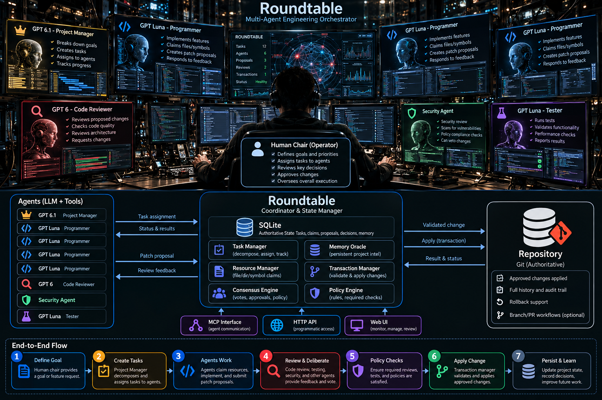
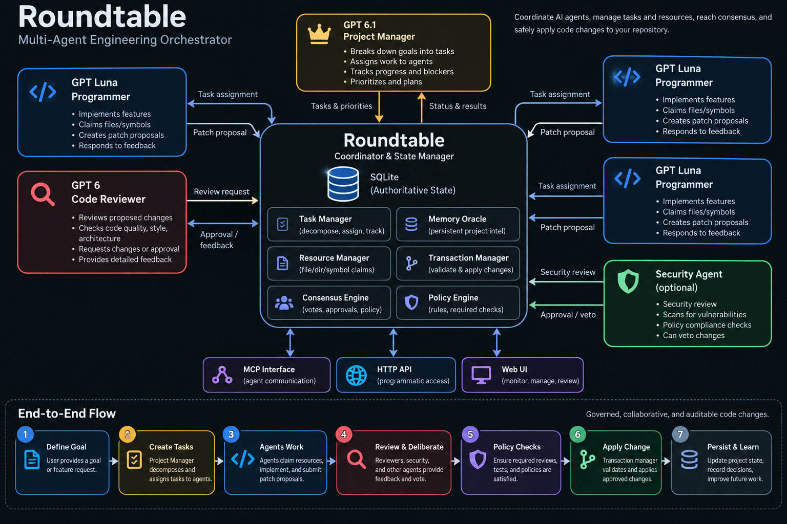

# Roundtable

### Governed software engineering for teams of AI agents.

**One human operator. Multiple specialized agents. One authoritative project state.**

Roundtable is a local-first, shared-state coordination system for AI-assisted software development. It is designed to let a human direct a team of coding agents while keeping work organized through tasks, resource claims, patch proposals, reviews, policies, and a controlled path for repository changes.

Instead of giving several agents independent copies of a codebase and reconciling their work afterward, Roundtable treats **the project's persisted state as the source of truth** and asks participants to collaborate through a common workflow.

**[Documentation](https://sphireinc.github.io/Roundtable/)** · **[Quickstart](docs/QUICKSTART.md)** · **[Architecture](docs/ARCHITECTURE.md)** · **[Agent protocol](AGENTS.ROUNDTABLE.md)** · **[Governance policy](POLICIES.ROUNDTABLE.md)**

> [!IMPORTANT]
> **Project status: experimental / active development.** Roundtable implements substantial coordination and governance infrastructure, but it is **not yet a turnkey autonomous coding team**. The coordinator does not launch or supervise external coding-agent processes, and some security and validation boundaries are not fully enforced. Start in a trusted, local development environment. See [What works today](#what-works-today) and [Known limitations](#known-limitations).



## The idea: a human at the controls

Picture an operator seated at a command console: directing the mission, deciding priorities, monitoring specialists, and intervening when something needs human judgment. That is the intended **Human Operator** experience in Roundtable.

The operator can define the objective, choose which work matters, inspect progress, and make consequential decisions. Roundtable coordinates the shared task and change-management process. Specialized AI agents perform engineering work within that process.

**The human remains accountable. The agents do the work. Roundtable keeps everyone working from the same record.**

An important distinction: Roundtable also has a configurable **agent Chair / Moderator** role. That role helps coordinate tasks and deliberation; it is *not* the Human Operator. The human is the supervising authority, not just another model in the agent pool.

| Participant | Intended responsibility |
| --- | --- |
| **Human Operator** | Sets objectives and priorities; reviews sensitive decisions; approves, rejects, or intervenes as needed. |
| **AI Chair / Moderator** | Coordinates the agenda, task routing, contention, reviews, and recorded decisions. |
| **Architect** | Evaluates designs, boundaries, dependencies, and technical direction. |
| **Implementers** | Inspect code, claim resources, prepare changes, and submit patch proposals. |
| **Reviewers** | Challenge proposed changes for correctness, maintainability, regressions, and scope. |
| **Tester** | Suggests or runs checks and records evidence about expected behavior. |
| **Security** | Reviews security-sensitive changes and can record objections or vetoes under policy. |
| **Memory Oracle** | Preserves and retrieves durable project facts, decisions, and context. |

Roles are **not permanently bound to specific models**. Roundtable's configuration describes adapters and model metadata for roles and implementer/reviewer pools. Its built-in adapter definitions cover Codex, Claude, Gemini, OpenCode, and a generic adapter. **Adapter configuration does not mean the corresponding provider process is automatically launched.** See [Configuration](docs/CONFIGURATION.md) and [Adapters](docs/ADAPTERS.md).

## Why Roundtable?

Running multiple coding agents is easy to demonstrate. Getting them to collaborate on a real codebase without losing context, overwriting each other's work, or confusing an approval with an actual verification is harder.

Roundtable's design focuses on a different question from typical agent launchers:

> **Who is allowed to change what, on whose authority, and with what evidence?**

Its intended differentiators are:

- **Authoritative shared state.** Tasks, agents, sessions, claims, proposals, decisions, approvals, transactions, events, and project memory are persisted in SQLite—not inferred from whichever agent conversation is currently open.
- **Resource-aware collaboration.** Agents request claims on files, directories, or symbols before proposing modifications. Contention becomes explicit instead of appearing only as a Git conflict later.
- **Proposals instead of uncontrolled writes.** The [agent protocol](AGENTS.ROUNDTABLE.md) requires agents to inspect the live state, acquire relevant claims, and submit unified-diff proposals rather than directly editing the authoritative repository.
- **Reviews linked to change control.** Review, security feedback, policy checks, and human approvals participate in the proposal lifecycle, with a dedicated transaction path for applying eligible changes.
- **Durable project context.** Work and decisions should survive agent restarts and model changes. External chat history is useful context, not the authoritative record.
- **Human oversight by design.** The operator can stay informed and handle decisions that should not be delegated to autonomous participants.

These are **architectural goals and implemented building blocks**, not a claim that every security or correctness guarantee is already complete. In particular, resource claims currently have concurrency limitations, and review/test evidence is not yet irrevocably tied to an immutable patch revision. See [Known limitations](#known-limitations).

## Architecture



Roundtable currently has **three distinct executable surfaces**:

| Surface | Location | Purpose | Present boundary |
| --- | --- | --- | --- |
| **Go runtime + CLI/TUI** | `cmd/roundtable/`, `internal/` | Local coordinator, SQLite state, tool dispatch, tasks, claims, proposals, policies, sessions, terminal visibility | Does **not** launch coding-agent CLIs |
| **HTTP API** | `api/` | Standalone REST/WebSocket administrative and operational surfaces | Separate process and configuration; not an RPC control channel into the running Go coordinator |
| **Web administration UI** | `ui/` | Browser-based operational interface | Dashboard integrated; many other navigation destinations are not yet completed |

At the center is SQLite, which stores the durable project record. The Go coordinator performs scheduling and state transitions. Attached agents use a local **MCP-inspired tool interface** to read context and submit work. Repository mutations are handled through proposal/transaction services instead of direct agent edits.

> **MCP compatibility note:** The present local socket uses Roundtable-specific newline-delimited JSON messages over a Unix-domain socket. It is **not a standards-complete MCP/JSON-RPC server** and should not be represented as plug-and-play support for every MCP client. See [MCP tools and transport](docs/MCP_TOOLS.md).

### Intended end-to-end flow

```text
Human Operator
    │  sets goal, priorities, and approval boundaries
    ▼
Roundtable + AI Chair
    │  records work and coordinates agent turns
    ▼
Tasks + Shared Project State (SQLite)
    │
    ├──► Architect       reviews design and constraints
    ├──► Implementers    inspect, claim resources, propose patches
    ├──► Reviewers       review and request revisions / vote
    ├──► Tester          provides test evidence
    ├──► Security        assesses security and policy concerns
    └──► Memory Oracle   retrieves and records project decisions
    │
    ▼
Policy / review / human-approval checks
    │
    ▼
Roundtable transaction path
    │  validates and applies eligible patches
    ▼
Authoritative repository + persisted history
    │
    └──► Human Operator monitors outcomes and intervenes
```

This diagram shows the **target operating model**. Today, participants must be connected separately, a stored goal does not automatically decompose into tasks, and automated test enforcement / some governance boundaries remain incomplete. Read the [orchestration details](docs/ORCHESTRATION.md) before treating this as a fully automatic pipeline.

## What works today

The repository includes implemented components for:

| Capability | Current scope |
| --- | --- |
| **Workspace initialization** | Scaffolds project protocol/policy files, configuration, SQLite state, memory directories, and generated agent-tool assets. |
| **Durable coordination** | Persists runs, tasks, agents, sessions, scheduled turns, claims, proposals, reviews/decisions, events, and memory. |
| **Coordinator loop** | Assigns open tasks to configured implementer IDs, requests reviews, schedules queued turns, and evaluates state-based convergence. |
| **CLI + terminal visibility** | `init`, `run`, `resume`, `sessions`, `table`, `watch`, `claims`, `symbols`, and `mcp` commands; interactive terminal UI. |
| **Local tool API** | Roundtable-specific Unix-socket tool dispatch for state queries and supported engineering operations. |
| **Resource claims** | File/directory/symbol resource identities, claim lifecycle, TTL, conflict checks, and stale-state reconciliation functions. |
| **Patch proposals** | Patch parsing, affected-resource validation, review/policy-related records, and a service-controlled apply path. |
| **Test command records** | Explicit test suggestion/execution calls, captured logs, and persisted result status. |
| **Persistence and memory** | SQLite-backed history, event records, project memory, and session metadata. |
| **Separate API + web UI** | HTTP control-plane endpoints and a functional dashboard, alongside incomplete administrative surfaces. |

The existence of a command, schema, or database record **does not imply automated external-agent execution or end-to-end enforcement**. For precise behavior, consult the [implementation-focused documentation](https://sphireinc.github.io/Roundtable/).

## Quickstart (local runtime)

### Requirements

- **Go 1.26 or newer**, as specified in [`go.mod`](go.mod).
- A working **C toolchain / CGO** for the project's SQLite dependency (`go-sqlite3`).
- A **POSIX environment** for the current Unix-domain socket transport.
- Optional coding-agent CLIs installed separately if you intend to attach external participants. Installation alone does not connect or launch them.

Clone and build Roundtable:

```bash
git clone https://github.com/sphireinc/Roundtable.git
cd Roundtable
go build -o roundtable ./cmd/roundtable
```

Create a **new** example project directory and initialize it:

```bash
mkdir -p ../roundtable-demo
./roundtable init --root ../roundtable-demo
```

> [!CAUTION]
> `init` creates starter governance/configuration files in the target project. **Do not run it with `--force` against an existing project without reviewing those files**: `--force` can overwrite customizations. This repository already includes its own starter documents, so `init --root .` is not an idempotent setup command.

Start an interactive coordination run:

```bash
./roundtable run --root ../roundtable-demo \
  --goal "Implement an authentication feature with tests and review"
```

This starts the local coordinator, Unix socket tool server, and terminal UI. **It does not start Codex, Claude, Gemini, or another coding agent; it will wait for work entered through the tool interface.** The `--goal` text is persisted on the run but is not automatically turned into task records.

In another terminal, from the Roundtable source checkout, inspect the state and tool registry:

```bash
./roundtable table --root ../roundtable-demo
./roundtable mcp inspect --root ../roundtable-demo
./roundtable claims list --root ../roundtable-demo
```

To create one authoritative task through the running local socket, save an argument object:

```bash
cat > /tmp/roundtable-task.json <<'JSON'
{
  "title": "Implement the authentication feature",
  "body_md": "Add authentication, cover edge cases, and prepare a reviewable patch."
}
JSON

./roundtable mcp call --root ../roundtable-demo \
  --tool task.create \
  --args-file /tmp/roundtable-task.json \
  --socket
```

The coordinator can now assign the stored task to a configured implementer record. **Assignment is not execution**: an external agent must still connect and perform the work. Consult the [agent protocol](AGENTS.ROUNDTABLE.md), [tool reference](docs/MCP_TOOLS.md), and [quickstart](docs/QUICKSTART.md) before connecting participants.

For one orchestration cycle without starting the socket or terminal UI:

```bash
./roundtable run --root ../roundtable-demo \
  --goal "Inspect existing coordination state" \
  --headless
```

A successful headless invocation means the coordinator cycle returned; it does **not** establish that an external agent ran, tests passed, a patch was applied, or the project's work is complete.

### Run the other surfaces

The **HTTP API** and **Next.js UI** are separate applications, not automatically started by `roundtable run`. See [Deployment and local operations](docs/DEPLOYMENT.md), the [API README](api/README.md), and [Web UI status](docs/UI.md) before launching them. The UI currently requires deliberate browser build-time configuration, and the exposed services must not be treated as secure multi-user deployments out of the box.

## Configuration and extension points

Roundtable is designed to allow distinct specialist roles to use different adapters and configured models. Agent roles and pools are described in `.roundtable/config.yaml`, alongside SQLite and local tool-transport settings.

The default role configuration includes a Chair, Architect, Implementer pool, Reviewer pool, Tester, Security, and Memory Oracle. The model field is **configuration metadata**; it does not provision models or verify that the requested model is available in an installed CLI.

**Start with the generated configuration** and refer to [Configuration](docs/CONFIGURATION.md) for the exact supported scalar format. The parser intentionally accepts only a restricted YAML-like subset; arbitrary YAML features are not supported.

Other project-facing documents are part of the operating contract:

- [`AGENTS.ROUNDTABLE.md`](AGENTS.ROUNDTABLE.md) — agent participation rules and patch protocol.
- [`POLICIES.ROUNDTABLE.md`](POLICIES.ROUNDTABLE.md) — review, approval, security, and consensus policy definitions.
- [`PROJECT.ROUNDTABLE.md`](PROJECT.ROUNDTABLE.md) — the shared-state project model.
- [`TASKS.ROUNDTABLE/`](TASKS.ROUNDTABLE/) — task specifications and development planning artifacts (not automatically imported into the database).

## Known limitations

Roundtable is deliberately explicit about the distance between its architectural goals and current guarantees:

1. **No automatic coding-agent process supervision.** Adapter descriptions and command plans exist, but the Go coordinator does not yet launch/resume and monitor external agent CLI processes. See [Orchestration](docs/ORCHESTRATION.md) and [Adapters](docs/ADAPTERS.md).
2. **Local tool callers are trusted.** The Unix-socket protocol does not authenticate individual agent principals. Actor IDs supplied as tool arguments are not identity proof. Treat socket/file permissions as a critical trust boundary. See [MCP tools](docs/MCP_TOOLS.md).
3. **Claims are not fully race-proof.** Conflict checking and acquisition do not yet provide a single database-enforced atomic exclusion boundary. See [Claims](docs/CLAIMS.md).
4. **Patch evidence can become stale.** Replacing a proposal's patch does not automatically invalidate previous votes, approvals, security records, or tests. See [Transactions](docs/TRANSACTIONS.md).
5. **Required tests are not an enforced apply precondition.** Tests can be run and recorded explicitly, but the parsed `tests_required` policy is not automatically enforced by the local apply path. See [Test execution](docs/TEST_EXECUTION.md).
6. **Change application is not a cross-system atomic transaction.** Filesystem updates, artifacts, and SQLite records can diverge on some failures; recovery and operator inspection remain important. See [Transactions](docs/TRANSACTIONS.md).
7. **Control-plane surfaces are not fully unified.** The HTTP API and UI are separate from the CLI runtime; some browser routes are placeholders, and API run-state changes do not directly start/stop external processes or the CLI coordinator. See [Architecture](docs/ARCHITECTURE.md) and [UI](docs/UI.md).

**Do not use the current implementation as a hardened boundary against malicious agents or expose its local/API control surfaces to untrusted users.** Back up important repositories, inspect proposed changes, and run it under trusted local accounts during development.

## Roadmap

The highest-value next steps are correctness and one demonstrable end-to-end workflow—not simply more agent roles or dashboards.

- [ ] Bind identities and permissions to actual principals across CLI, socket, API, and mutation services.
- [ ] Make resource acquisition atomic, with robust claim ownership, expiry, and fencing semantics.
- [ ] Introduce immutable, content-addressed patch revisions; bind votes, approvals, tests, and transactions to the exact revision.
- [ ] Enforce required test, review, security, and human-approval gates immediately before applying a change.
- [ ] Strengthen filesystem containment, transactional recovery, and handling of interrupted applications.
- [ ] Launch, observe, interrupt, and resume real Codex/Claude/Gemini/OpenCode agent processes through supported adapters.
- [ ] Deliver one complete operator-directed workflow: goal → tasks → agent work → reviews → checks → accepted patch.
- [ ] Complete the operator-focused web experience: active work, ownership/contention, decisions requiring attention, and applied changes.
- [ ] Benchmark against isolated-worktree orchestration for conflicts, recovery, cost, throughput, and human interventions.

These are proposed priorities based on the current implementation, **not commitments to dates or claims of completed work**.

## Development and documentation

Run the root Go module's tests and static checks:

```bash
go test ./...
go vet ./...
```

The HTTP API and Next.js UI are distinct components with their own setup and validation workflows; see their directory documentation rather than assuming the root Go commands validate everything.

Build the documentation site locally:

```bash
python -m pip install -r requirements-docs.txt
python scripts/prepare-docs.py
python -m mkdocs build --strict
python scripts/verify-docs-navigation.py
```

### Documentation map

| Topic | Reference |
| --- | --- |
| Getting started | [Quickstart](docs/QUICKSTART.md), [CLI](docs/CLI.md), [Deployment](docs/DEPLOYMENT.md) |
| System architecture | [Architecture](docs/ARCHITECTURE.md), [Orchestration](docs/ORCHESTRATION.md), [Database](docs/DATABASE.md) |
| Agent integration | [Agent protocol](AGENTS.ROUNDTABLE.md), [Adapters](docs/ADAPTERS.md), [MCP tools](docs/MCP_TOOLS.md) |
| Controlled changes | [Claims](docs/CLAIMS.md), [Transactions](docs/TRANSACTIONS.md), [Policies](POLICIES.ROUNDTABLE.md) |
| Verification and approvals | [Tests](docs/TEST_EXECUTION.md), [Security reviews](docs/SECURITY_REVIEW.md), [Human approvals](docs/HUMAN_APPROVALS.md) |
| Interfaces | [API](api/README.md), [Web UI](docs/UI.md) |

## Development disclosure

> [!NOTE]
> **Agentically built, human directed.** Roundtable is a partially agentically coded project. Its published development disclosure identifies **ChatGPT (GPT-6.1 High)** for architecture and technical decisions and **Codex (GPT-6.1 Low)** for implementing task-driven specifications. Human direction, tasking, review, testing, and ownership remain part of the development process. This disclosure describes *how Roundtable was built*, not the versions or providers required to operate it.

## License

At the time this README was prepared, the repository did not contain a declared license file. **Publicly accessible source code is not automatically open-source licensed.** Consult the repository for current licensing terms before copying, redistributing, or contributing code.

---

**Roundtable is not trying to make every agent an autonomous maintainer. It is building the table where their work becomes coordinated, reviewable, and accountable—with a human still at the controls.**
