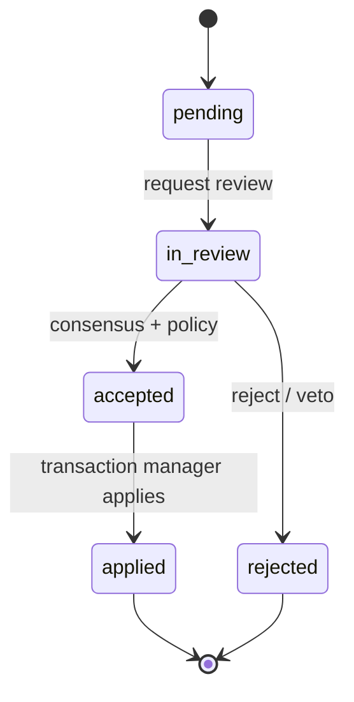

# Roundtable Admin API guide

This guide is generated from [`api/openapi.yaml`](../openapi.yaml). Regenerate it with `ruby api/scripts/generate-admin-api-guide.rb` after changing the contract. All routes use `/api/v1` except the Prometheus `/metrics` endpoint.

## Shared contract

- Responses are JSON; errors are RFC 7807 `application/problem+json` with `request_id` and `code`.
- Every response includes `X-Request-ID`; pass `X-Correlation-ID` to connect a human action to downstream events.
- Human mutations use `X-Actor-ID` and an allowlisted `X-Actor-Role`; configured deployments use a human bearer token. Agent/MCP calls use a separate agent token.
- Mutations that can be retried declare `Idempotency-Key`; body-bearing mutations replay the original response, while empty-body lifecycle transitions are re-evaluated.
- Collection pages use `limit` (maximum 200) and opaque `cursor` values. Never construct a cursor.
- State-changing handlers validate current state in the same transaction that writes state, audit the action, and publish an after-commit event where applicable.

## Endpoint inventory

| Method | Path | Operation | Permission / boundary | Idempotency | Responses |
|---|---|---|---|---|---|
| `GET` | `/api/v1/health` | `getHealth` | view | not required | 200 |
| `GET` | `/api/v1/status` | `getStatus` | view | not required | 200 |
| `GET` | `/api/v1/security/capabilities` | `getSecurityCapabilities` | view | not required | 200, 401 |
| `GET` | `/metrics` | `getMetrics` | Prometheus scrape | not required | 200 |
| `GET` | `/api/v1/maintenance` | `getMaintenanceStatus` | view | not required | 200, 503 |
| `POST` | `/api/v1/maintenance/integrity-check` | `runIntegrityCheck` | role-gated human | required | 200, 400, 403, 409 |
| `POST` | `/api/v1/maintenance/checkpoint` | `checkpointDatabase` | role-gated human | required | 200, 400, 403, 409 |
| `POST` | `/api/v1/maintenance/backup` | `createDatabaseBackup` | role-gated human | required | 201, 400, 403, 409 |
| `POST` | `/api/v1/maintenance/retention` | `runRetentionCleanup` | role-gated human | required | 200, 400, 403, 409 |
| `GET` | `/api/v1/workspaces/{id}/health` | `getWorkspaceHealth` | view | not required | 200, 404 |
| `GET` | `/api/v1/workspaces` | `listWorkspaces` | view | not required | 200, 500 |
| `POST` | `/api/v1/workspaces` | `createWorkspace` | orchestrator or human | not required | 201, 400, 403 |
| `GET` | `/api/v1/workspaces/{id}` | `getWorkspace` | view | not required | 200, 404 |
| `PATCH` | `/api/v1/workspaces/{id}` | `updateWorkspace` | orchestrator or human | not required | 200, 403, 404 |
| `DELETE` | `/api/v1/workspaces/{id}` | `detachWorkspace` | orchestrator or human | not required | 200, 403, 404 |
| `GET` | `/api/v1/workspaces/{id}/repository` | `getRepositoryStatus` | view | not required | 200, 404, 409 |
| `POST` | `/api/v1/workspaces/{id}/repository/branch-switch/preflight` | `preflightRepositoryBranchSwitch` | role-gated human | not required | 200, 400, 403 |
| `POST` | `/api/v1/workspaces/{id}/repository/branch-switch` | `switchRepositoryBranch` | role-gated human | required | 200, 400, 403, 409 |
| `GET` | `/api/v1/workspaces/{id}/repository/entities` | `listRepositoryEntities` | view | not required | 200, 400, 404 |
| `GET` | `/api/v1/workspaces/{id}/repository/entities/{entity_id}` | `getRepositoryEntity` | view | not required | 200, 404 |
| `GET` | `/api/v1/workspaces/{id}/agents` | `listAgents` | view | not required | 200, 404 |
| `GET` | `/api/v1/workspaces/{id}/agents/{agent_id}` | `getAgent` | view | not required | 200, 404 |
| `POST` | `/api/v1/workspaces/{id}/agents/{agent_id}/enable` | `enableAgent` | role-gated human | required | 200, 403 |
| `POST` | `/api/v1/workspaces/{id}/agents/{agent_id}/disable` | `disableAgent` | role-gated human | required | 200, 403, 409 |
| `POST` | `/api/v1/workspaces/{id}/agents/{agent_id}/diagnostics` | `runAgentDiagnostics` | role-gated human | required | 202, 403, 404 |
| `GET` | `/api/v1/workspaces/{id}/sessions` | `listSessions` | view | not required | 200 |
| `POST` | `/api/v1/workspaces/{id}/sessions` | `createSession` | role-gated human | required | 201, 403 |
| `GET` | `/api/v1/workspaces/{id}/sessions/{session_id}` | `getSession` | view | not required | 200, 404 |
| `POST` | `/api/v1/workspaces/{id}/sessions/{session_id}/pause` | `pauseSession` | role-gated human | not required | 200, 403, 409 |
| `POST` | `/api/v1/workspaces/{id}/sessions/{session_id}/resume` | `resumeSession` | role-gated human | required | 200, 403, 409 |
| `POST` | `/api/v1/workspaces/{id}/sessions/{session_id}/stop` | `stopSession` | role-gated human | not required | 200, 403, 409 |
| `POST` | `/api/v1/workspaces/{id}/sessions/{session_id}/terminate` | `terminateSession` | role-gated human | required | 200, 403, 409 |
| `POST` | `/api/v1/workspaces/{id}/sessions/{session_id}/heartbeat` | `heartbeatSession` | orchestrator or human | not required | 200, 409 |
| `GET` | `/api/v1/workspaces/{id}/sessions/{session_id}/logs` | `listSessionLogs` | view | not required | 200, 404 |
| `GET` | `/api/v1/workspaces/{id}/sessions/{session_id}/tool-calls` | `listSessionToolCalls` | view | not required | 200, 404 |
| `GET` | `/api/v1/workspaces/{id}/sessions/{session_id}/claims` | `listSessionClaims` | view | not required | 200, 404 |
| `GET` | `/api/v1/workspaces/{id}/sessions/{session_id}/proposals` | `listSessionProposals` | view | not required | 200, 404 |
| `GET` | `/api/v1/workspaces/{id}/sessions/{session_id}/metrics` | `getSessionMetrics` | view | not required | 200, 404 |
| `GET` | `/api/v1/workspaces/{id}/sessions/{session_id}/environment` | `getSessionEnvironment` | view | not required | 200, 404 |
| `GET` | `/api/v1/workspaces/{id}/deliberations` | `listDeliberations` | view | not required | 200, 404 |
| `POST` | `/api/v1/workspaces/{id}/deliberations` | `createDeliberation` | role-gated human | required | 201, 400, 403, 409 |
| `GET` | `/api/v1/workspaces/{id}/deliberations/{deliberation_id}` | `getDeliberation` | view | not required | 200, 404 |
| `POST` | `/api/v1/workspaces/{id}/deliberations/{deliberation_id}/{action}` | `transitionDeliberation` | role-gated human | required | 200, 403, 409 |
| `POST` | `/api/v1/workspaces/{id}/deliberations/{deliberation_id}/messages` | `addDeliberationMessage` | role-gated human | not required | 201, 403, 409 |
| `GET` | `/api/v1/workspaces/{id}/deliberations/{deliberation_id}/transcript` | `listDeliberationTranscript` | view | not required | 200, 404 |
| `GET` | `/api/v1/workspaces/{id}/deliberations/{deliberation_id}/transcript/{entry_id}` | `getDeliberationTranscriptEntry` | view | not required | 200, 404 |
| `GET` | `/api/v1/workspaces/{id}/proposals` | `listProposals` | view | not required | 200, 404 |
| `POST` | `/api/v1/workspaces/{id}/proposals/internal` | `createInternalProposal` | orchestrator or human | required | 201, 400, 403, 409 |
| `GET` | `/api/v1/workspaces/{id}/proposals/{proposal_id}` | `getProposal` | view | not required | 200, 404 |
| `POST` | `/api/v1/workspaces/{id}/proposals/{proposal_id}/{action}` | `transitionProposal` | role-gated human | required | 200, 403, 409 |
| `GET` | `/api/v1/workspaces/{id}/proposals/{proposal_id}/patch` | `getPatchMetadata` | view | not required | 200, 400, 404 |
| `GET` | `/api/v1/workspaces/{id}/proposals/{proposal_id}/patch/files` | `listPatchFiles` | view | not required | 200, 400 |
| `GET` | `/api/v1/workspaces/{id}/proposals/{proposal_id}/patch/diff` | `listPatchDiffChunks` | view | not required | 200, 400 |
| `GET` | `/api/v1/workspaces/{id}/proposals/{proposal_id}/patch/symbol-impact` | `listPatchSymbolImpact` | view | not required | 200, 400 |
| `POST` | `/api/v1/workspaces/{id}/proposals/{proposal_id}/validation` | `rerunProposalValidation` | role-gated human | required | 202, 400, 403, 404 |
| `GET` | `/api/v1/workspaces/{id}/proposals/{proposal_id}/votes` | `listProposalVotes` | view | not required | 200, 404 |
| `POST` | `/api/v1/workspaces/{id}/proposals/{proposal_id}/votes` | `castProposalVote` | orchestrator or human | required | 201, 400, 403, 404, 409 |
| `GET` | `/api/v1/workspaces/{id}/proposals/{proposal_id}/consensus` | `getProposalConsensus` | view | not required | 200, 404 |
| `GET` | `/api/v1/workspaces/{id}/analytics/consensus` | `getConsensusAnalytics` | view | not required | 200, 400, 404 |
| `GET` | `/api/v1/workspaces/{id}/policies` | `listPolicies` | view | not required | 200, 404 |
| `POST` | `/api/v1/workspaces/{id}/policies` | `createPolicy` | role-gated human | required | 201, 400, 403, 409 |
| `GET` | `/api/v1/workspaces/{id}/policies/{policy_id}` | `getPolicy` | view | not required | 200, 404 |
| `GET` | `/api/v1/workspaces/{id}/policies/{policy_id}/revisions` | `listPolicyRevisions` | view | not required | 200, 404 |
| `POST` | `/api/v1/workspaces/{id}/policies/{policy_id}/{action}` | `transitionPolicy` | role-gated human | required | 200, 403, 404, 409 |
| `GET` | `/api/v1/workspaces/{id}/approvals` | `listHumanApprovals` | view | not required | 200, 404 |
| `POST` | `/api/v1/workspaces/{id}/approvals` | `requestHumanApproval` | orchestrator or human | required | 201, 400, 403, 404, 409 |
| `GET` | `/api/v1/workspaces/{id}/approvals/{approval_id}` | `getHumanApproval` | view | not required | 200, 404 |
| `POST` | `/api/v1/workspaces/{id}/approvals/{approval_id}/{action}` | `decideHumanApproval` | role-gated human | required | 200, 400, 403, 404, 409 |
| `GET` | `/api/v1/workspaces/{id}/transactions` | `listTransactions` | view | not required | 200, 404 |
| `GET` | `/api/v1/workspaces/{id}/transactions/{transaction_id}` | `getTransaction` | view | not required | 200, 404 |
| `GET` | `/api/v1/workspaces/{id}/transactions/{transaction_id}/phases` | `listTransactionPhases` | view | not required | 200, 404 |
| `GET` | `/api/v1/workspaces/{id}/transactions/{transaction_id}/recovery` | `getTransactionRecovery` | view | not required | 200, 404 |
| `GET` | `/api/v1/workspaces/{id}/runs/status` | `getRunStatus` | view | not required | 200, 404 |
| `POST` | `/api/v1/workspaces/{id}/runs/{action}` | `transitionRun` | role-gated human | required | 200, 400, 403, 409 |
| `GET` | `/api/v1/workspaces/{id}/dashboard/summary` | `getDashboardSummary` | view | not required | 200, 404 |
| `GET` | `/api/v1/workspaces/{id}/activity` | `listActivityFeed` | view | not required | 200, 404 |
| `GET` | `/api/v1/workspaces/{id}/events/ws` | `connectWorkspaceEvents` | view | not required | 101, 400, 401, 404 |
| `GET` | `/api/v1/workspaces/{id}/events/snapshot` | `getWorkspaceEventSnapshot` | view | not required | 200, 404 |
| `GET` | `/api/v1/workspaces/{id}/memories` | `listMemories` | view | not required | 200, 404 |
| `POST` | `/api/v1/workspaces/{id}/memories` | `createMemoryNote` | orchestrator or human | required | 201, 400, 403, 409 |
| `GET` | `/api/v1/workspaces/{id}/memories/{memory_id}` | `getMemory` | view | not required | 200, 404 |
| `POST` | `/api/v1/workspaces/{id}/memories/{memory_id}/revisions` | `createMemoryRevision` | orchestrator or human | required | 200, 400, 403, 404, 409 |
| `GET` | `/api/v1/workspaces/{id}/memories/{memory_id}/revisions` | `listMemoryRevisions` | view | required | 200, 404 |
| `GET` | `/api/v1/workspaces/{id}/memories/{memory_id}/diff` | `getMemoryRevisionDiff` | view | not required | 200, 404 |
| `GET` | `/api/v1/workspaces/{id}/memories/{memory_id}/graph` | `getMemoryGraph` | view | not required | 200, 404 |
| `GET` | `/api/v1/workspaces/{id}/memories/{memory_id}/source-chain` | `getMemorySourceChain` | view | not required | 200, 404 |
| `POST` | `/api/v1/workspaces/{id}/memories/{memory_id}/{action}` | `transitionMemory` | orchestrator or human | required | 200, 400, 403, 404, 409 |
| `GET` | `/api/v1/workspaces/{id}/notifications` | `listNotifications` | view | not required | 200, 404 |
| `GET` | `/api/v1/workspaces/{id}/notifications/counts` | `getNotificationCounts` | view | not required | 200, 404 |
| `POST` | `/api/v1/workspaces/{id}/notifications/{notification_id}/ack` | `acknowledgeNotification` | orchestrator or human | required | 200, 403, 404, 409 |
| `GET` | `/api/v1/workspaces/{id}/logs/operational` | `listOperationalLogs` | view | not required | 200, 404 |
| `GET` | `/api/v1/workspaces/{id}/audit` | `listAuditEvents` | view | not required | 200, 404 |
| `GET` | `/api/v1/workspaces/{id}/audit/export` | `exportAuditEvents` | view | not required | 200, 403, 404 |
| `GET` | `/api/v1/workspaces/{id}/settings` | `getEffectiveSettings` | view | not required | 200, 404 |
| `GET` | `/api/v1/workspaces/{id}/settings/schema` | `getSettingsSchema` | view | not required | 200, 404 |
| `POST` | `/api/v1/workspaces/{id}/settings/preflight` | `preflightSettingsUpdate` | orchestrator or human | not required | 200, 400, 403 |
| `PATCH` | `/api/v1/workspaces/{id}/settings/{section}` | `updateSettingsSection` | orchestrator or human | required | 200, 400, 403, 409 |
| `POST` | `/api/v1/workspaces/{id}/transactions/{transaction_id}/{action}` | `transitionTransaction` | role-gated human | required | 200, 400, 403, 404, 409 |
| `GET` | `/api/v1/workspaces/{id}/claims` | `listClaims` | view | not required | 200, 404 |
| `POST` | `/api/v1/workspaces/{id}/claims/internal` | `createInternalClaim` | orchestrator or human | required | 201, 400, 403, 409 |
| `GET` | `/api/v1/workspaces/{id}/claims/{claim_id}` | `getClaim` | view | not required | 200, 404 |
| `POST` | `/api/v1/workspaces/{id}/claims/{claim_id}/{action}` | `transitionClaim` | role-gated human | required | 200, 400, 403, 409 |
| `GET` | `/api/v1/workspaces/{id}/claims/contentions` | `listClaimContentions` | view | not required | 200, 404 |
| `POST` | `/api/v1/workspaces/{id}/claims/contentions/{contention_id}/resolve` | `resolveClaimContention` | role-gated human | required | 200, 400, 403, 404, 409 |

## State machines

Claims use `active -> released|expired|suspended`; transactions use `staged -> validating -> applying -> applied|failed`, with compensation represented as a new governed proposal.

## Local fixtures

The realistic dashboard payload pack is in [`api/examples/dashboard-fixtures.json`](../examples/dashboard-fixtures.json). Start the API with `go run ./api/cmd/server -addr 127.0.0.1:8080 -workspace-root .`, then use the examples as response fixtures; no fixture contains secrets or absolute repository paths.
